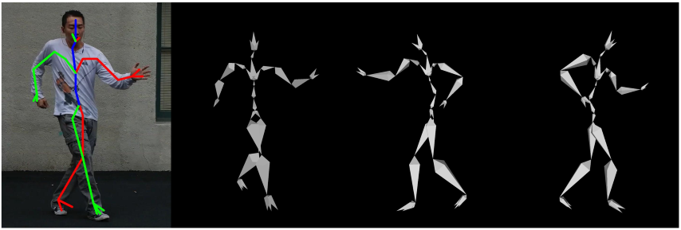

# Minimal Body



A very simple baseline to estimate 2D & 3D SMPL-compatible keypoints from a single color image.

The model file is only 51.2 MB and runs at 70fps on a 2080Ti.

## Usage

1. Download the pre-trained model [here](https://github.com/CalciferZh/minimal-body/releases/download/v1/minimal_body_v1.pth) into `model/`.
2. Install the dependencies.
3. Run `python example.py`.

The input image should already be cropped to a 4:3 portrait with the subject in the center.

## Misc

We will __not__ release the training code.

The model is trained using the following datasets jointly:
* [COCO](https://cocodataset.org/)
* [MPII2D](http://human-pose.mpi-inf.mpg.de/)
* [MPII3D](https://vcai.mpi-inf.mpg.de/3dhp-dataset/)
* [HUMBI](https://humbi-data.net/)
* [HM36M](http://vision.imar.ro/human3.6m/description.php)
* [MTC](http://domedb.perception.cs.cmu.edu/mtc.html)
* [SPIN](https://github.com/nkolot/SPIN)

Please also check the license of the listed datasets.

If you find it helpful, please consider citing our related paper:

```
@InProceedings{Zhou_2021_CVPR,
    author    = {Zhou, Yuxiao and Habermann, Marc and Habibie, Ikhsanul and Tewari, Ayush and Theobalt, Christian and Xu, Feng},
    title     = {Monocular Real-Time Full Body Capture With Inter-Part Correlations},
    booktitle = {Proceedings of the IEEE/CVF Conference on Computer Vision and Pattern Recognition (CVPR)},
    month     = {June},
    year      = {2021},
    pages     = {4811-4822}
}
```
